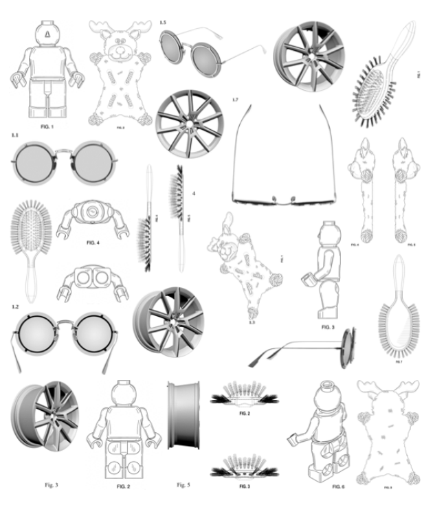
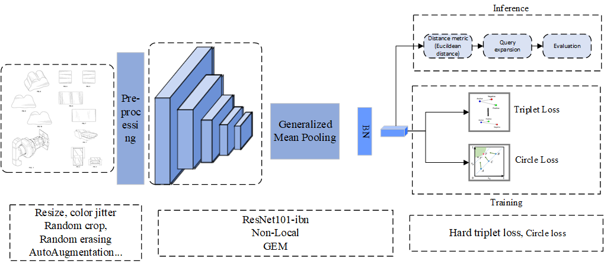

# Report for ECCV DIRA Data Challenge

## Introduction

Illustrations, drawings, technical diagrams and diagrams can help people quickly understand difficult concepts. This kind of visual information is very popular in our daily life. However, there are many challenges in processing such visual data. As shown Fig 1, these images are similar to hand-drawn sketches, lacking background or other contextual information in the images. These images often provide several different viewpoints, which increases the difficulty of image retrieval. This challenge requires participants to extract robust image representations from the DeepPatent dataset for abstract diagram retrieval. Given a query image, participants were required to retrieve images belonging to the same patent or representing similar objects. We found that this patent retrieval task is very similar to the person re-identification task. Therefore, we design a framework for patent retrieval based on the person Re-ID methods. The rest of our report is organized as follows: In Section 2, we describe our approach, including overview, data augmentation, backbone, loss, post-processing, training details and dataset usage; In Section 3, we describe our code usage.



# Method

## Overview

The framework of our method is shown in Figure1, which consists of Data Augmentation, backbone , loss , testing details, training details and datasets modules.




### Data Augmentation

we use autoaugment method[1]. It can search appropriate composed augmentation including flip, rotate, bright/color change · · · etc. Random Erasing is also utilize to avoid model overfitting.

### Backbone

The backbone network is a very important module for extracting image representations in image retrieval task. We adopt ResNet101[1] as our backbone. IBN[1] and Non-local[1] modules are added to ResNet101 to get more robust features. IBN is.  Both modules are used to help model to learn a better universal image representations. The input image size is set to 256 in the first stage and 384 in the second stage. After the backbone network, a BN layer and Generalized Mean Pooling (GEM) are utilized to extract the retrieval features and a classifier layer is used to output the probability of different IDs.

### Losses

In the training,  circle loss[] and soft-margin triplet loss[] are utilized for metric learning.


### Testing

In the test phase, the patent images are input into our model to extract features. And the similary scores between query and gallery features by calculating the Euclidean distance. The DBA and AQE are utilized as post-processing. AQE first calculate the top-k similar images for the query image. And then the new query and gallery features are updated by the weighted sum of these similar images features.   DBA re-compulate the feautre by averaring the top-k similairy images in the 


### Training


### Dataset

We only utilize the DeepPatent dataset for training and validation. The training set contains...

### Reference


## Code for ECCV DIRA Data Challenge

The following describe our code for DIRA Data Challenge

### Requirements

- Linux or macOS with python ≥ 3.6

- PyTorch ≥ 1.6

- [yacs](https://github.com/rbgirshick/yacs)

- Cython (optional to compile evaluation code)

- tensorboard (needed for visualization): `pip install tensorboard`

- gdown (for automatically downloading pre-train model)

- sklearn

- termcolor

- tabulate

- [faiss](https://github.com/facebookresearch/faiss) `pip install faiss-gpu`

- for conda

  ```
  conda create -n fastreid python=3.8
  conda activate fastreid
  conda install pytorch==1.7.1 torchvision tensorboard -c pytorch
  pip install -r docs/requirements.txt
  ```

We use GPU 3090 for training and testing. The cuda version is 11.1, torch version is 1.7.1, the python version is 3.8.8.

### Dataset

Download the competition datasets patent data and codalab test set, and then unzip them under the datasets directory like: 

```
datasets
├── train_data
|	└── patent_data
|		└── I20180102
|		└── ...
|	└── train_patent_val.txt
|	└── train_patent_trn.txt
├── test_data
|	└── codalab_test_set
|	└── database
|	└── lists
|	└── queries

```

### Prepare Pre-trained Models

You can download the pre-trained model form this link: https://drive.google.com/drive/folders/1DMcAnAHZ54QZPi9KxkgPA9er_uE76dP3?usp=sharing. Then you should save it under the path of logs. The file tree should be like as:

```
logs
└── Patent	
    └── R101_384
    	└── model_best.pth
```

### Test

You can get the final result.npy by running:

```
CUDA_VISIBLE_DEVICES=0 python3 tools/test.py --config-file ./configs/patent/sbs_R101-ibn_patent_test.yml --eval-only  MODEL.DEVICE "cuda:0"
```

It will generate result.npy  in the root dir, which is the final result. The test process takes approximately 4 hours.

### Training

```
CUDA_VISIBLE_DEVICES=0 python3 tools/train_net.py --config-file ./configs/patent/sbs_R101-ibn_patent_256.yml MODEL.DEVICE "cuda:0" 
CUDA_VISIBLE_DEVICES=0 python3 tools/train_net.py --config-file ./configs/patent/sbs_R101-ibn_patent_384.yml MODEL.DEVICE "cuda:0" 
```

We train our model through two stage. Stage1 train the original dataset with 256$\times$ 256 resolution . Stage2 finetune the trainset with 384 resolution which is inspired by **[kaggle-landmark-2021-1st-place](https://github.com/ChristofHenkel/kaggle-landmark-2021-1st-place)**.  

